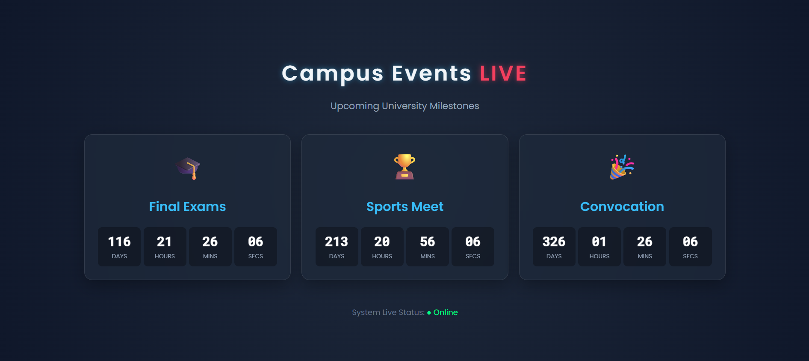

# 🎓 Campus Event Countdown Ticker

A high-visibility, real-time dashboard designed to track time remaining for major university milestones (Final Exams, Sports Meets, Convocation). This project features a modern **Neon Glassmorphism** UI and is fully responsive for mobile devices.

 
*(Note: Upload your screenshot to the repo and replace 'screenshot.png' with your image filename)*

## 🚀 Project Overview
This tool acts as a "Digital Notice Board" for students. It uses JavaScript to calculate the time difference between the current date and target event dates, updating the countdown every second without refreshing the page.

### ✨ Key Features
* **Live Countdown:** Real-time updates for Days, Hours, Minutes, and Seconds.
* **Modern UI:** Dark mode with Neon Glow and Glassmorphism effects.
* **Responsive Design:** optimized for both desktop screens and mobile phones.
* **Auto-Focus:** Visual cues to highlight upcoming events.

## 🛠️ Technologies Used
* **Frontend:** HTML5, CSS3 (Animations, Flexbox), JavaScript (ES6).
* **Fonts:** Google Fonts (Poppins & Roboto Mono).
* **Hosting:** AWS EC2 (Amazon Linux 2023).
* **Web Server:** Apache HTTP Server.

## ⚙️ How to Run Locally
1.  Clone this repository or download the ZIP file.
2.  Open the `index.html` file in any modern web browser.
3.  To change event dates, open `script.js` and modify the `events` object dates.

## ☁️ Deployment Details (AWS EC2)
This project is hosted on an AWS EC2 instance.
* **Instance Type:** t2.micro (Free Tier).
* **OS:** Amazon Linux 2023.
* **Server:** Apache (`httpd`).
* **Security:** Port 80 (HTTP) opened for public access.

**Deployment Steps Taken:**
1.  Installed Apache: `sudo yum install httpd -y`
2.  Started Server: `sudo systemctl start httpd`
3.  Uploaded files via SCP: `scp -i key.pem index.html ec2-user@<IP>:/var/www/html`
